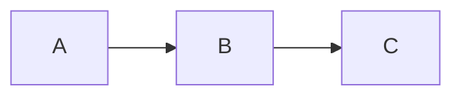
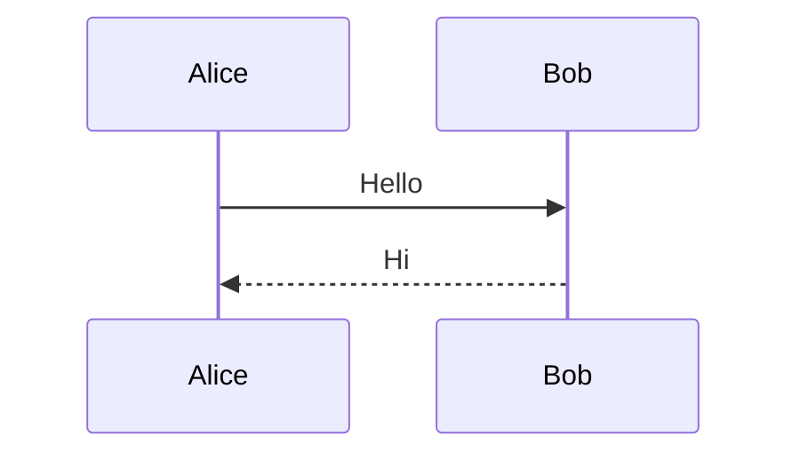
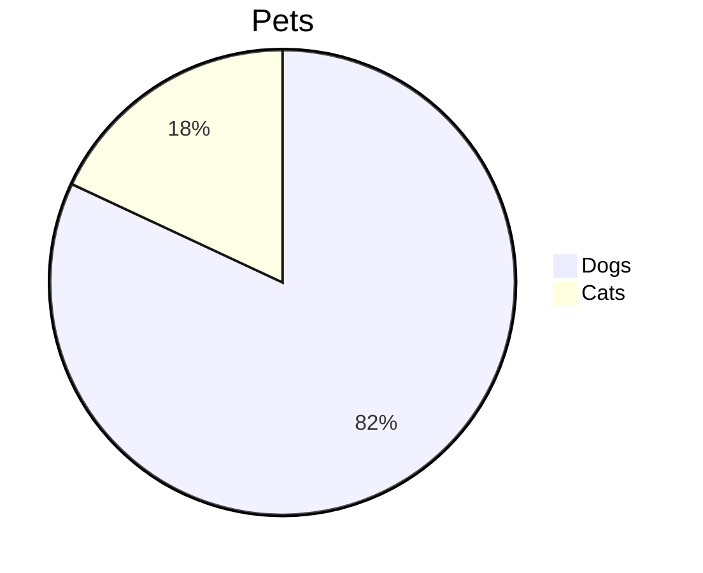

# markdownlint-rule-mermaid

A [markdownlint](https://github.com/DavidAnson/markdownlint) custom rule for validating Mermaid diagram syntax in Markdown code blocks.

This rule uses the official [mermaid](https://www.npmjs.com/package/mermaid) package to parse and validate diagrams, providing accurate syntax checking.

## Installation

```bash
npm install markdownlint-rule-mermaid
```

## Usage

### With markdownlint-cli2

Create or update `.markdownlint-cli2.jsonc`:

```jsonc
{
  "customRules": ["markdownlint-rule-mermaid"]
}
```

### With markdownlint Node.js API

```javascript
import markdownlint from 'markdownlint/promise';
import mermaidRule from 'markdownlint-rule-mermaid';

const result = await markdownlint({
  files: ['README.md'],
  customRules: [mermaidRule],
  config: {
    'mermaid-syntax': true
  }
});
```

## Rule Details

This rule validates Mermaid diagram syntax in fenced code blocks marked with the `mermaid` language identifier.

### What it detects

- Empty Mermaid diagrams
- Unknown diagram types
- Syntax errors (unclosed brackets, invalid keywords, etc.)
- Malformed diagram structures

### Valid Examples

````markdown





````

### Invalid Examples

````markdown
```mermaid
flowchart LR
  A --> [B
```
<!-- Error: Unclosed bracket -->

```mermaid

```
<!-- Error: Empty diagram -->

```mermaid
unknownDiagram
  A --> B
```
<!-- Error: Unknown diagram type -->
````

## Configuration

```jsonc
{
  "mermaid-syntax": {
    // Use basic validation only (skip mermaid parser)
    // Useful if mermaid package causes issues in your environment
    "basic": false
  }
}
```

### Options

| Option | Type | Default | Description |
|--------|------|---------|-------------|
| `basic` | boolean | `false` | Use basic validation only (checks for empty diagrams and diagram type presence) |

## Supported Diagram Types

All diagram types supported by Mermaid are validated:

- flowchart / graph
- sequenceDiagram
- classDiagram
- stateDiagram
- erDiagram
- journey
- gantt
- pie
- mindmap
- timeline
- gitGraph
- quadrantChart
- requirementDiagram
- C4 diagrams
- sankey
- block
- xychart
- zenuml
- and more...

## Requirements

- Node.js >= 18.0.0
- markdownlint >= 0.35.0

## License

MIT
