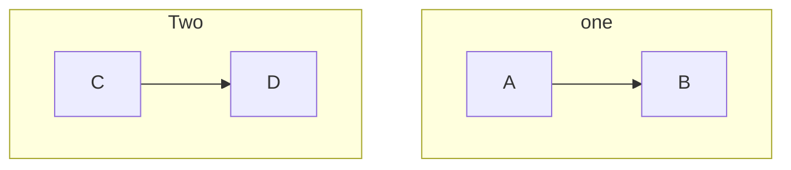
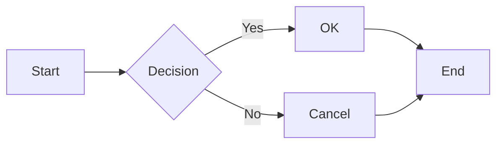
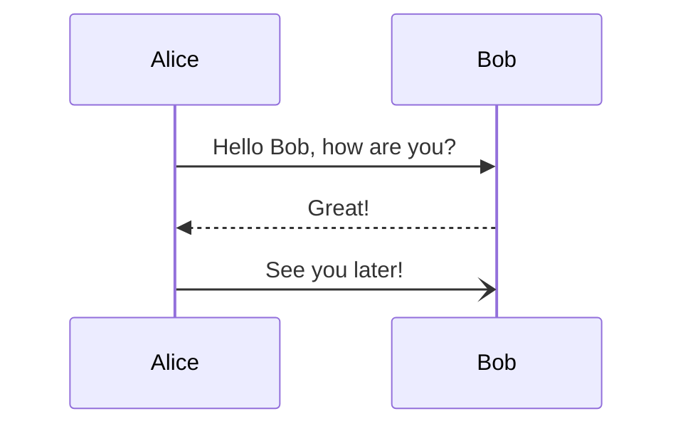
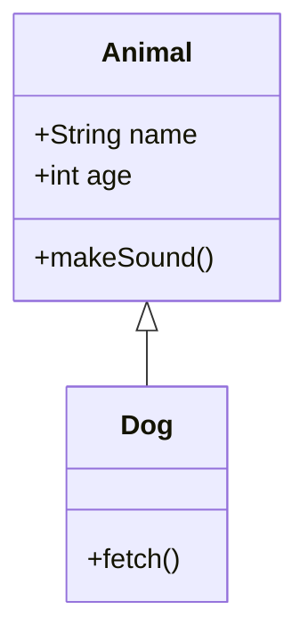
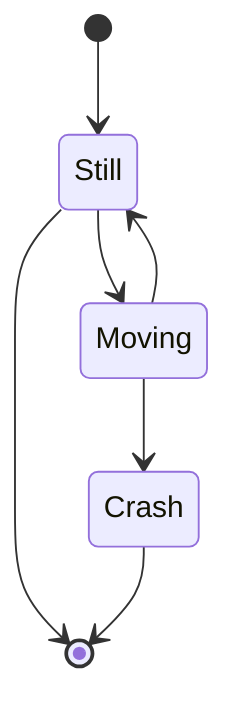
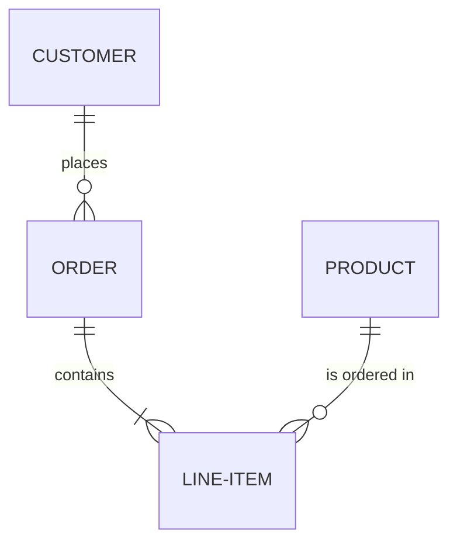
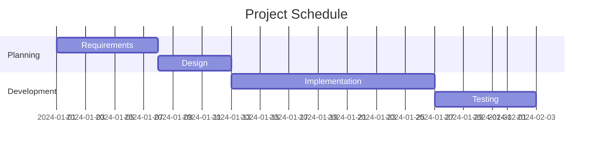
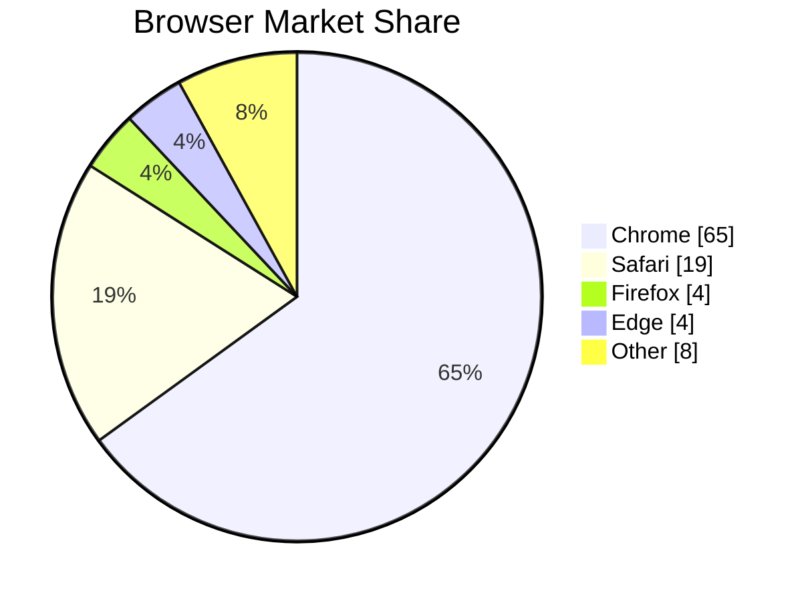
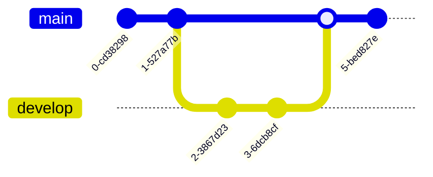

# markdownlint-rule-mermaid

[](https://www.npmjs.com/package/markdownlint-rule-mermaid)
[](https://www.npmjs.com/package/markdownlint-rule-mermaid)
[](https://opensource.org/licenses/MIT)
[](https://nodejs.org)

A [markdownlint](https://github.com/DavidAnson/markdownlint) custom rule for validating Mermaid diagram syntax and KaTeX/LaTeX math expressions in Markdown code blocks.

## Features

### Mermaid Validation (`mermaid-syntax`)

- **Accurate Validation**: Uses the official [mermaid](https://www.npmjs.com/package/mermaid) parser for precise syntax checking
- **Helpful Error Messages**: Provides detailed hints for fixing common errors
- **Line Number Mapping**: Reports exact line numbers in your Markdown file
- **All Diagram Types**: Supports flowcharts, sequence diagrams, class diagrams, and more
- **HTML Support**: Validates mermaid diagrams in HTML blocks (`<pre class="mermaid">`, `<div class="mermaid">`)
- **Parallel Validation**: Efficiently validates multiple diagrams in a single document

### KaTeX/Math Validation (`katex-syntax`)

- **LaTeX Validation**: Uses the official [KaTeX](https://www.npmjs.com/package/katex) parser
- **Multiple Languages**: Supports `math`, `latex`, `tex`, and `katex` code blocks
- **Rich Error Messages**: Provides hints for undefined commands, missing braces, etc.
- **HTML Support**: Validates math in HTML blocks (`<span class="math">`, `<div class="math">`)

### Shared Features

- **Type-Safe**: Built with TypeScript and neverthrow for robust error handling

## Installation

### npm

```bash
npm install markdownlint-rule-mermaid
```

### pnpm

```bash
pnpm add markdownlint-rule-mermaid
```

### yarn

```bash
yarn add markdownlint-rule-mermaid
```

## Quick Start

### 1. Install the rule

```bash
npm install markdownlint-rule-mermaid markdownlint-cli2
```

### 2. Create configuration file

Create `.markdownlint-cli2.jsonc` in your project root:

```jsonc
{
  "customRules": ["markdownlint-rule-mermaid"]
}
```

### 3. Run markdownlint

```bash
npx markdownlint-cli2 "**/*.md"
```

## Usage

### With markdownlint-cli2 (Recommended)

[markdownlint-cli2](https://github.com/DavidAnson/markdownlint-cli2) is the recommended CLI for markdownlint.

#### Basic Configuration

`.markdownlint-cli2.jsonc`:

```jsonc
{
  "customRules": ["markdownlint-rule-mermaid"]
}
```

#### With Rule Options

`.markdownlint-cli2.jsonc`:

```jsonc
{
  "customRules": ["markdownlint-rule-mermaid"],
  "config": {
    "mermaid-syntax": {
      "basic": false
    },
    "katex-syntax": {
      "displayMode": false
    }
  }
}
```

#### YAML Configuration

`.markdownlint-cli2.yaml`:

```yaml
customRules:
  - markdownlint-rule-mermaid
config:
  mermaid-syntax:
    basic: false
```

### With markdownlint-cli

[markdownlint-cli](https://github.com/igorshubovych/markdownlint-cli) also supports custom rules.

```bash
npx markdownlint --rules markdownlint-rule-mermaid "**/*.md"
```

With configuration file `.markdownlintrc`:

```json
{
  "mermaid-syntax": true
}
```

### With Node.js API

```javascript
import { lint } from 'markdownlint/promise';
import mermaidRule from 'markdownlint-rule-mermaid';

const results = await lint({
  files: ['README.md', 'docs/**/*.md'],
  customRules: [mermaidRule],
  config: {
    'mermaid-syntax': true
  }
});

// Process results
for (const [file, errors] of Object.entries(results)) {
  for (const error of errors) {
    console.log(`${file}:${error.lineNumber}: ${error.ruleDescription}`);
    if (error.errorDetail) {
      console.log(`  ${error.errorDetail}`);
    }
  }
}
```

### With VS Code

Install the [markdownlint extension](https://marketplace.visualstudio.com/items?itemName=DavidAnson.vscode-markdownlint) and configure it:

`.vscode/settings.json`:

```json
{
  "markdownlint.customRules": [
    "markdownlint-rule-mermaid"
  ]
}
```

Or use a workspace configuration file `.markdownlint-cli2.jsonc` (the extension automatically detects it).

### With Pre-commit Hook

Using [husky](https://github.com/typicode/husky) and [lint-staged](https://github.com/lint-staged/lint-staged):

`package.json`:

```json
{
  "lint-staged": {
    "*.md": "markdownlint-cli2"
  }
}
```

### With GitHub Actions

`.github/workflows/lint.yml`:

```yaml
name: Lint Markdown

on: [push, pull_request]

jobs:
  markdownlint:
    runs-on: ubuntu-latest
    steps:
      - uses: actions/checkout@v4
      - uses: actions/setup-node@v4
        with:
          node-version: '20'
      - run: npm install markdownlint-cli2 markdownlint-rule-mermaid
      - run: npx markdownlint-cli2 "**/*.md"
```

## Error Messages

This package provides detailed error messages with hints for fixing common mistakes.

### Mermaid Errors

#### Empty Diagram

```
README.md:5 mermaid-syntax Mermaid diagram syntax should be valid
  Empty Mermaid diagram. Add a diagram type (e.g., flowchart, sequenceDiagram) and content
```

**Fix**: Add diagram type and content to the code block.

#### Unknown Diagram Type

```
README.md:5 mermaid-syntax Mermaid diagram syntax should be valid
  Unknown diagram type: "invalidType". Valid types: flowchart, sequenceDiagram, classDiagram, stateDiagram, erDiagram, gantt, pie, mindmap, timeline, gitGraph
```

**Fix**: Use a valid Mermaid diagram type.

#### Unclosed Bracket

```
README.md:7 mermaid-syntax Mermaid diagram syntax should be valid
  Unclosed square bracket. Add closing ] to complete the node shape: A[text]
```

**Fix**: Close all brackets in node definitions.

#### Unclosed Block

```
README.md:10 mermaid-syntax Mermaid diagram syntax should be valid
  Unclosed block. Add "end" to close subgraph, loop, alt, opt, par, critical, rect, or state block
```

**Fix**: Add `end` keyword to close the block.

#### Incomplete Statement

```
README.md:6 mermaid-syntax Mermaid diagram syntax should be valid
  Incomplete statement. Add missing parts (e.g., colon for messages: Alice->>Bob: message)
```

**Fix**: Complete the statement with required syntax.

### KaTeX Errors

#### Empty Math Block

```
README.md:5 katex-syntax KaTeX/LaTeX math syntax should be valid
  Empty math block. Add a LaTeX expression (e.g., E = mc^2)
```

**Fix**: Add a LaTeX expression to the code block.

#### Undefined Control Sequence

```
README.md:5 katex-syntax KaTeX/LaTeX math syntax should be valid
  Undefined control sequence: \unknowncommand. Check for typos in command names or use \text{} for regular text
```

**Fix**: Check the command name for typos or use a supported KaTeX command.

#### Missing Argument

```
README.md:5 katex-syntax KaTeX/LaTeX math syntax should be valid
  Expected '}', got 'EOF' at end of input. Make sure all braces {} are properly closed
```

**Fix**: Add the missing closing brace or argument.

## Configuration Options

### Mermaid Rule (`mermaid-syntax`)

| Option | Type | Default | Description |
|--------|------|---------|-------------|
| `basic` | boolean | `false` | Use basic validation only (checks for empty diagrams and diagram type presence, skips mermaid parser) |

#### When to Use Basic Mode

Set `basic: true` if:

- The mermaid package causes issues in your environment
- You want faster validation (no parser overhead)
- You only need to check for empty diagrams and diagram type presence

```jsonc
{
  "mermaid-syntax": {
    "basic": true
  }
}
```

### KaTeX Rule (`katex-syntax`)

| Option | Type | Default | Description |
|--------|------|---------|-------------|
| `displayMode` | boolean | `false` | Parse in display mode (centered, larger symbols) |
| `strict` | boolean | `false` | Enable strict mode for LaTeX parsing |

```jsonc
{
  "katex-syntax": {
    "displayMode": true,
    "strict": false
  }
}
```

## Supported Diagram Types

All diagram types supported by Mermaid are validated:

| Category | Diagram Types |
|----------|---------------|
| **Flowcharts** | `flowchart`, `graph` |
| **Sequence** | `sequenceDiagram` |
| **Class** | `classDiagram`, `classDiagram-v2` |
| **State** | `stateDiagram`, `stateDiagram-v2` |
| **Entity Relationship** | `erDiagram` |
| **User Journey** | `journey` |
| **Gantt** | `gantt` |
| **Pie Chart** | `pie` |
| **Quadrant Chart** | `quadrantChart` |
| **Requirement** | `requirementDiagram` |
| **Git Graph** | `gitGraph` |
| **Mindmap** | `mindmap` |
| **Timeline** | `timeline` |
| **Sankey** | `sankey-beta` |
| **XY Chart** | `xychart-beta` |
| **Block** | `block-beta` |
| **C4 Diagrams** | `C4Context`, `C4Container`, `C4Component`, `C4Dynamic`, `C4Deployment` |
| **ZenUML** | `zenuml` |

## Backward Compatibility

This rule supports both legacy and modern Mermaid syntax. The official mermaid parser maintains full backward compatibility.

### Legacy Syntax Support

| Category | Legacy Syntax | Modern Syntax | Status |
|----------|---------------|---------------|--------|
| Flowcharts | `graph TD` | `flowchart TD` | Both supported |
| State Diagrams | `stateDiagram` | `stateDiagram-v2` | Both supported |
| Class Diagrams | `classDiagram` | `classDiagram-v2` | Both supported |

### Arrow Syntax

All arrow styles are supported:

```mermaid
graph LR
    A --> B    %% Standard arrow
    B --- C    %% Line without arrow
    C -.-> D   %% Dotted arrow
    D ==> E    %% Thick arrow
    E --o F    %% Circle end
    F --x G    %% Cross end
```

### Subgraph Syntax

Both legacy and modern subgraph syntax are supported:

````markdown

````

## HTML Embedded Mermaid

This rule also validates mermaid diagrams embedded in HTML tags within Markdown files. This is useful when using mermaid with static site generators or custom renderers.

### Supported HTML Patterns

```html
<!-- Using pre tag with mermaid class -->
<pre class="mermaid">
flowchart LR
    A --> B
</pre>

<!-- Using div tag with mermaid class -->
<div class="mermaid">
flowchart LR
    A --> B
</div>

<!-- Using code tag with language-mermaid class -->
<code class="language-mermaid">
flowchart LR
    A --> B
</code>

<!-- Multiple classes are supported -->
<pre class="diagram mermaid syntax-highlight">
flowchart LR
    A --> B
</pre>
```

### HTML Entity Decoding

HTML entities in mermaid code are automatically decoded:

```html
<pre class="mermaid">
flowchart LR
    A --&gt; B
</pre>
```

The `&gt;` entity is decoded to `>` before validation.

### Limitations

- HTML blocks separated by blank lines are parsed as multiple blocks by markdown-it
- Avoid blank lines inside HTML mermaid blocks for proper detection:

```html
<!-- Good: No blank lines inside -->
<div class="mermaid">
flowchart LR
    A --> B
</div>

<!-- May cause issues: Blank line inside -->
<div class="mermaid">

flowchart LR
    A --> B
</div>
```

## Examples

### Flowchart

````markdown

````

### Sequence Diagram

````markdown

````

### Class Diagram

````markdown

````

### State Diagram

````markdown

````

### ER Diagram

````markdown

````

### Gantt Chart

````markdown

````

### Pie Chart

````markdown

````

### Git Graph

````markdown

````

## KaTeX/Math Examples

### Simple Equation

````markdown
```math
E = mc^2
```
````

### Fraction

````markdown
```latex
\frac{a + b}{c - d}
```
````

### Sum and Integral

````markdown
```math
\sum_{i=1}^{n} x_i = \int_{0}^{\infty} f(x) dx
```
````

### Matrix

````markdown
```math
\begin{pmatrix}
a & b \\
c & d
\end{pmatrix}
```
````

### Greek Letters

````markdown
```tex
\alpha + \beta = \gamma
```
````

### Complex Expression

````markdown
```katex
\lim_{x \to \infty} \left(1 + \frac{1}{x}\right)^x = e
```
````

## Troubleshooting

### "Cannot find module 'markdownlint-rule-mermaid'"

Make sure the package is installed:

```bash
npm install markdownlint-rule-mermaid
```

### Slow Validation

The first validation may be slow due to mermaid initialization. Subsequent validations are faster due to caching.

If speed is critical, use basic mode:

```jsonc
{
  "mermaid-syntax": {
    "basic": true
  }
}
```

### Memory Issues

Mermaid requires a DOM environment. If you encounter memory issues, try:

1. Use basic mode
2. Increase Node.js memory limit: `NODE_OPTIONS=--max-old-space-size=4096`

### False Positives

If you believe a valid diagram is being reported as invalid:

1. Check if the diagram renders correctly on [Mermaid Live Editor](https://mermaid.live/)
2. Ensure you're using the latest version of this rule
3. [Open an issue](https://github.com/cuzic/markdownlint-rule-mermaid/issues) with the diagram that causes the false positive

## Requirements

- **Node.js**: >= 18.0.0
- **markdownlint**: >= 0.35.0

## Related Projects

- [markdownlint](https://github.com/DavidAnson/markdownlint) - Markdown linter
- [markdownlint-cli2](https://github.com/DavidAnson/markdownlint-cli2) - CLI for markdownlint
- [mermaid](https://github.com/mermaid-js/mermaid) - Diagram and flowchart generation

## Contributing

Contributions are welcome! Please feel free to submit a Pull Request.

1. Fork the repository
2. Create your feature branch (`git checkout -b feature/amazing-feature`)
3. Run tests (`npm test`)
4. Run linter (`npm run lint`)
5. Commit your changes (`git commit -m 'feat: add amazing feature'`)
6. Push to the branch (`git push origin feature/amazing-feature`)
7. Open a Pull Request

## License

MIT
